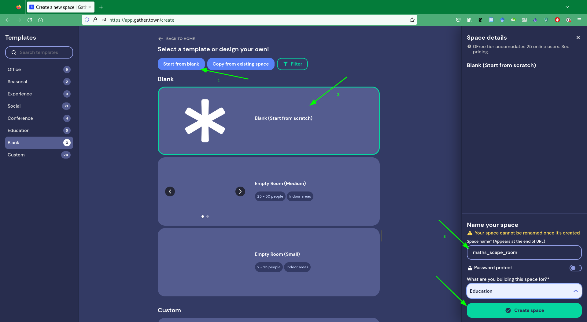

# Mathematical Virtual Escape Room Based on Gather Town

This repository contains the source code and assets developed for our research
project about mathematical communication. In it, we propose an activity based on
a Escape Room whose aim is to improve the mathematical communication among our
students.

The game is developed using the platform . This platform aims to convert virtual interactions
into a more human experience. To that purpose, they offer a website with
capability to create virtual spaces where attendants can interact with each
other and the surroundings. Moreover, they provide an (still experimental) API

to interact with the spaces programmatically. Using this API, objects can be
placed in the environment, and they can be provided with interactivity.

We leverage the flexibility of the platform and the API they provide to build an
interactive activity for our students. The activity is prepared to be played by
a group of 3 students, and it is composed of 5 tasks, ordered by ascending
difficulty.

This repository provides all the information you need to setup the activity with
your own students.

## Activity description and example

The proposed activity is an escape room composed of 5 tasks. Tasks are ordered
in ascending difficulty, and they are tackled in a sequential manner. In order
to improve the communication capabilities of our students, the game is built in
such a way that players' paths are disjoint. Once the escape room starts, each
player will be teleported to an independent room, and they will not be able to
visit the rooms of their partners (although they can see each other in the
screen). The information needed to solve the problems will be then presented in
a fragmented way, and each player will find only a fragment of the information
needed to solve the task. Thus, they will have to communicate their information
to each other to solve the assignment properly. Without this communication, the
problems are not solvable, since every piece of information is relevant to the
task.

The students' workflow during the activity is pretty straightforward. They will
find each task subsequently, and the path to continue will be blocked by a door
that can be opened by solving the current task. After they have solved it, a
computer accessible by one of the students will ask for the solution. If the
provided solution is correct, the doors of the three participants will unlock
and they will be able to go on to the next assignment. Their objective is to
escape from the building, whose exit is placed after the fifth task.

An example of the escape room can be found
. Feel
free to roam around the game and interact with the objects to grasp the
intention of the activity. When you are finished, go to the master controls
section to reset the room for the next visitor.

<!-- TODO: Add a proper link to the functioning room -->
<!-- TODO: Add a proper link to the master section -->

> DISCLAIMER: Problem statements are written in spanish (our mother
> tongue). However, it should not be difficult to modify the code to translate
> it into other languages.

## Gather Town environment structure

Gather town spaces are composed of rooms. Rooms in the space are connected so
you can travel from one room to another by moving in the space. In our case,
there are 8 rooms:

- `explanation_room`: It is the landing room of the space. By default, the first
  time somebody enters in our space, will appear in this room. It is connected
  using teleports to the three starting rooms for the players. It also contains
  a restricted area (locked using a password door), where the computer with the
  game master controls is placed. We will specify the master controls and how to
  use them later.
- `first_room_{1,2,3}`: Three identical copies of the room where the players
  start the game. Each player starts the game in one of those rooms. They will
  access them after the teacher explanation using the portals in the explanation
  room. These rooms are connected to the `problems_1_2` room, where the students
  will confront the first two tasks. The connecting door is closed, and can be
  unlocked by answering a simple question in the room computer. This simple
  interaction seeks to teach the students on how to interact with the engine in
  a simple manner. Also, in the room there is a walkie-talkie that opens a
  Google Meet call. Students can use this call to communicate to each
  other. Since Gather Town only allows to communicate with other participants
  that are close to us, and we have placed the students in different rooms, we
  need to provide this external communication method to them.
- `problems_1_2`: In this room, the first two problems are proposed. The room is
  separated in three paths, one for each student, and each path is separated in
  two parts by a locked door. In the first part, the first problem is proposed.
  After it is solved, the door is unlocked, and the second part of the room is
  accessible. In the second part lies the second problem of the activity. After
  it is solved, a door to visit the next room is unlocked for each player.
- `problems_3_4`: As in the previous case, this room is divided in three paths,
  each one with two parts separated by a door. In each part, one problem is
  given. Upon completion, each problem opens a door. Problem 3 opens the door to
  the second part of the room, problem 4 opens the door to next room.
- `problem_5`: This room proposes the last problem of the game. The first part
  of this room is separated in three paths, as it was in previous rooms. In the
  second part of the room, paths of the three players come together, and the
  door to the outside of the building can be found. Those two parts are
  separated by doors, as in the other problems.
- `outside`: This is the last accessible room of our game. Players will get to
  it when they have solved all the problems.

Players can travel from one room to the other using the doors they will find
during the game. The only point where returning is not allowed is between the
explanation room and the first rooms, since we want to enforce each player not
to visit their mates' paths. However, if one player accidentally steps into the
wrong portal, it is possible to respawn to the explanation room using the
"Respawn" button in Gather Town menu.

## Repository structure

In this section, the structure of the repository is outlined. You can find more
information about each subpart by visiting the file README.md inside each of the
folders.

- [`room_scenarios_assets`](room_scenarios_assets): In this folder, the image
  files that define the different scenarios in the game are given. In the
  corresponding README, some indications about the files and the tools used to
  create them are given.
- [`code`](code): In this folder, the source code implemented to deploy the
  objects in the space and provide them interactivity is stored. In the
  corresponding README, and in-depth explanation of the code and how to run it
  is given.
- [`exercise_materials`](exercise_materials): In this folder, the additional
  materials prepared for the game are stored. In the README, an explanation on
  how to make that information available to the players is given.

## System setup

In order to use this activity with your students, you will have to follow a
series of steps to have your own instance of the game running. This steps have
been tested on a Linux machine (specifically, using Ubuntu 20), but most of them
should be equivalent in other operative systems. Feel free to open an issue if
you find any problem, and I will try to answer as soon as possible.

- Create an account in [Gather Town](https://gather.town).
- Create a blank space, choose a name and a purpose and press "Create Space"
  
  
  
- Enter into MapMaker tool by selecting the editing tool and choosing "Edit
  in MapMaker"
  
- Create the rooms for the space. You will need the following rooms:
  - `explanation_room`: The room where the game will start. It is the place where
    the players will begin when entering the space for the first time. You can
    modify the name of the default room, changing it from `blank` to `explanation_room`
  - `first_room_1`, `first_room_2` and `first_room_3`: The rooms where the players
    will be teleported after the initial explanation (one for each player).
  - `problems_1_2`: Room where the players will face the first two problems in
    the game.
  - `problems_3_4`: Room where the players will face the problems 3 and 4 of the
    game.
  - `problem_5`: Room for the last problem.
  - `outside`: Room accessed at the end of the game.
  
  
- Upload the background and foreground for each room using MapMaker.
  
- Set the walls as impassable tiles, and add at least one spawn tile for each
  room. Only the spawn tiles in the explanation room will be used, and they have
  to be placed in the left part of the room. The spawn tiles in the other maps
  will not be used, but Gather Town enforces to add at least one spawn tile in
  each room.
  
- Copy the room IDs for each room into the file `config.ts` inside the folder
  `code`. You can copy the room ID using the three dots in the right of the room
  name and choosing "Copy room ID".
  
- Use the script `setup_rooms.ts` in folder `code` to place the objects in the
  rooms. Details about how to run the script in the following section.

### Objects deployment and listeners

In order to finish the game setup, you will have to perform two additional
operations to place the interactive objects and run the listeners for them. This
is done using a TypeScript library provided by the Gather Town developers. You
can check the docs
[here](http://gather-game-client-docs.s3-website-us-west-2.amazonaws.com/modules.html). There are two ways to perform this deployment:

__Using docker and docker-compose__

If you are familiar with `docker` and `docker-compose`, it is probably the
easiest way to perform this two steps. In order to setup the game, this steps
have to be followed:

- Make sure that configuration files are setup properly. You have to configure
  file `code/.env` with information about your Gather account and space you
  want to modify. More information about this process in the `code` folder. Also,
  make sure that `code/config.ts` has the proper room IDs for your space.
- Execute the following commands in a terminal, starting in the root of this
  repository:
  ```
  cd code
  docker-compose build
  docker-compose up gather-setup-1
  ```
  This commands will run a Docker container that places all the objects in their
  correct place, and prepares the teleports between rooms so the students can move
  in through the game rooms.
- After that command is finished, use `docker-compose up -d gather-listeners-1`
  to run the listeners for the game. You need to keep that container running to
  interact with the objects. If the container is not running, computers that
  allow the students to open the door will be unresponsive.

## Game master controls

In order to control the room within the game, two objects have been included
into the explanation room: a computer to control the blocked doors and a door
blocking the access to that computer.


The computer allows the game master to open or close all the doors in the
game. Interacting with it, you can specify commands `open` and `close` to open
or close all the doors in the game. Additionally, you can specify a problem in
the second box (using `problem-X` to act over the problem number X) to act only
with the doors related to that problem.

The blocking door prevents the rest of the players to access to the computer
without permission. Interacting with it, you will be prompted to give a password
to open it. That password is `YouShallNotPass`

> If you interact with the game in
> https://app.gather.town/app/iC2DLiAyR23qxOlS/paper_gather_town, please close
> all the doors in the end, so a new visitor can enjoy the game from the
> beginning.
