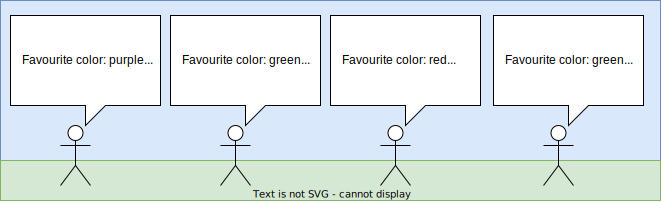

# Exercises' material

This folder contains the additional material developed for the problems. Most of
this information are parts of the task statements, which will be explained
below. Since we present the statements in a fragmented way, for each task, we
will show the complete assignment to be solved, and present the three fragments
afterwards. It is done this way because we think it is important to get the
broader picture of the statement before delving into the fragments.

> DISCLAIMER: Although the statements are listed in english below, all the
> generated material is in spanish. Adapt it to english if needed

## Exercise 1: Calculate fence size using a system of equations

### Complete statement

Given the following diagram, and knowing that the building walls facing the
courtyard have the same length, the exterior fence is 5 m shorter than either of
the two building walls, and that the perimeter of the courtyard is 25 m, how
long is one building wall?

### Fragments given to the students

__Player 1__: Building walls facing the courtyard have the same length. The
perimeter of the courtyard is 25 m.

__Player 2__: The exterior fence of the courtyard is 5 m shorter than either of
the two building walls.

__Player 3__: Finds the diagram shown above

## Exercise 2: Calculate statistics of a population

### Complete statement

Through the windows of the building you can see a group of people. Each of you
can see some of them. Be careful, because some people might be seen by more than
one of you, but you want to count their information only once. We know that
there are 9 people in total. We want to calculate the average of their heights.

NOTE: When compiling the information, you will have to coordinate to avoid
counting the repeated individuals twice.

### Fragments given to the students

__Player 1__: Finds the heading text and the first of the images.

__Player 2__: Finds the heading text and the second of the images.

__Player 3__: Finds the heading text and the third of the images.

## Exercise 3: Construction using GeoGebra

### Complete statement

One of the enemy's spies has been sent on a secret mission to visit some of the
government buildings. To continue, you must trace the route followed by the spy
from the instructions available. The spy left this building and returned to it
after visiting all the other locations. The password that will allow you to open
the door is the area of the figure that appear when you trace the spy's route
through the various buildings. You can use the drawing system in the room to
solve this problem.

SPY'S PATH: At first, the spy left this building and traveled 2 km north, to the
airport. From the airport, it moved 3 km east to get to the hospital. Next, from
the hospital it went to a secret base, placed 4 km to the north. From the secret
base, he traveled 2 km east to arrive to the spatial station. Then, he walked 6
km south to get to the communications station from the spatial station. Finally,
he covered 5 km west from the communications station to return to this building.

### Fragments given to the students

__Player 1__: The first common paragraph, a TV where he can follow the GeoGebra
construction, and the following sentences from the spy's path:

- Next, from the hospital it went to a secret base, placed 4 km to the north.
- From the airport, it moved 3 km east to get to the hospital.
- Then, he walked 6 km south to get to the communications station from the
spatial station.

__Player 2__: The first common paragraph and a poster where he can build the
GeoGebra construction. No commands from the spy's path are given to this
student.

__Player 3__: The first common paragraph, a TV where he can follow the GeoGebra
construction, and the following sentences from the spy's path:

- Finally, he covered 5 km west from the communications station to return to
this building.
- From the secret base, he traveled 2 km east to arrive to the spatial station.
- At first, the spy left this building and traveled 2 km north, to the airport.

## Exercise 4: Selection of a function for a trajectory and vertex calculation

### Complete statement

In this laboratory research is being carried out with state-of-the-art
technological instruments. During the last few months, a vertical take-off
rocket has been tested. In the last test, the rocket took off from the ground in
time t=0, rose to a certain height (in m), and then returned to the ground. You
must find out which function describes the trajectory of the rocket, and then
calculate the maximum height reached.

### Fragments given to the students

__Player 1__: The first paragraph and the rocket trajectory.

__Player 2__: The first paragraph and the first set of formulas.

__Player 3__: The first paragraph and the second set of formulas.

## Exercise 5: Probabilities ordering in polygons

### Complete statement

### Fragments given to the students

In this exercise, each student receives the previous document with some parts
torn out, so only one design and part of the additional information is shown.
You can check the examples of torn documents in spanish in files
(documento_player1.pdf)[exercise_5/documento_player1.pdf],
(documento_player2.pdf)[exercise_5/documento_player2.pdf] and
(documento_player3.pdf)[exercise_5/documento_player3.pdf]

__Player 1__: Only design A and additional information 3 and 4 are shown.

__Player 2__: Only design B and additional information 2 are shown.

__Player 3__: Only design C and additional information 1 are shown.
